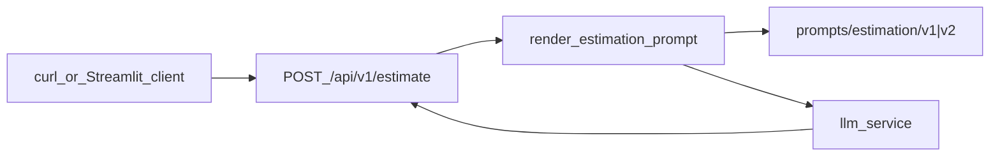

# Estimator CAG — AI-Powered Software Estimation Service

AI-powered software project estimation service using a **Cache Augmented Generation (CAG)** architecture.

## What is CAG and why we use it

CAG (Cache Augmented Generation) is an architecture pattern where relevant context is injected directly into the LLM prompt as static text. In this project phase, reference estimations are included as few-shot examples inside the system prompt — no vector database or semantic search required.

The current implementation uses **Jinja2** templates under `app/prompts/estimation/`: each version (`v1`, `v2`) has `system.j2`, `user.j2`, and `examples.j2`, rendered by `app/prompts/loader.py`. Two prompt sets exist for live A/B comparisons in demos.

This approach is ideal to start because:
- It is simple to implement and debug
- It requires no extra infrastructure (no embeddings, no vector stores)
- It works well when context volume is manageable (a few examples)

In later master modules, this service will evolve to a **RAG** (Retrieval Augmented Generation) architecture with a vector database to handle a larger example corpus.

## Prerequisites

- **Docker** and **Docker Compose** installed (for the API)
- An **API key** for OpenAI, Anthropic, or Google Gemini
- **uv** and Python 3.11+ (for local runs or Streamlit)
- Python is **not** required locally if you only use Docker for the API

## Configuration

Copy the environment file and set your variables:

```bash
cp .env.example .env
# Edit .env and set your real API key
```

| Variable | Description |
|----------|-------------|
| `LLM_PROVIDER` | Active provider: `openai`, `anthropic`, or `gemini` |
| `LLM_MODEL` | Provider model (e.g. `gpt-4o-mini`, `claude-haiku-4-5`, `gemini-2.0-flash`) |
| `OPENAI_API_KEY` | OpenAI key (required when `LLM_PROVIDER=openai`) |
| `ANTHROPIC_API_KEY` | Anthropic key (required when `LLM_PROVIDER=anthropic`) |
| `GEMINI_API_KEY` | Google Gemini key (required when `LLM_PROVIDER=gemini`) |
| `APP_ENV` | Environment: `development`, `staging`, or `production` |
| `LOG_LEVEL` | Log level: `DEBUG`, `INFO`, `WARNING`, or `ERROR` |
| `MAX_CONVERSATION_TURNS` | User/assistant pairs kept in memory per session (default: `6`) |
| `MAX_ATTACHMENT_CHARS` | Cap on extracted attachment text (default: `60000`) |
| `LLM_CACHE_ENABLED` | Enable exact/semantic LLM response cache (default: `true`) |
| `SEMANTIC_CACHE_THRESHOLD` | Similarity threshold for semantic cache (default: `0.85`) |
| `TIER_MEDIUM_CHARS` | Enriched transcript size for `medium` tier (default: `8000`) |
| `TIER_HIGH_CHARS` | Enriched transcript size for `high` tier (default: `20000`) |

`.env.example` defaults to `openai`; without a `.env` file, `app/config.py` falls back to `anthropic` / `claude-haiku-4-5`.

**Important:** `get_settings()` is cached with `@lru_cache`. After editing `.env`, **restart the process** (uvicorn or Streamlit). Uvicorn's `--reload` flag does not reload the cached settings singleton.

## Quick start with Docker (recommended)

1. Clone the repository and enter the directory:
   ```bash
   cd estimator
   ```

2. Configure `.env` (see section above).

3. Build and start the service:
   ```bash
   docker compose up --build
   ```

4. The API will be available at `http://localhost:8000`

> Docker runs **only the API** (port 8000). The Streamlit UI is not included in `docker-compose.yml` and must be run locally (see below).

## Alternative: local run without Docker

```bash
uv sync
# Configure .env with your API keys
uv run uvicorn app.main:app --reload
```

## Web UI (Streamlit — Session 5)

Multi-turn conversational client that talks to the session API. **Requires FastAPI running in parallel.**

```bash
# Terminal 1 — API
uv run uvicorn app.main:app --reload

# Terminal 2 — Streamlit
uv sync
cp .env.example .env   # configure API key for your LLM_PROVIDER
uv run streamlit run streamlit_app.py
```

Open `http://localhost:8501`. On page load a session is created (`POST /sessions`) and `session_id` is stored. The main area accepts a **transcript** and PDF/DOCX attachments; **Estimate** sends `POST /sessions/{session_id}/estimate`. The sidebar shows updated `project_metadata` after each turn and a **New conversation** button that creates a fresh session and resets local state.

HTTP client details (no direct LLM calls): [docs/ARCHITECTURE.md#clients](docs/ARCHITECTURE.md#clients).

## Conversational sessions (Session 5)

The service supports multi-turn estimation with in-process memory and document attachments.

### Endpoints

| Method | Route | Description |
|--------|-------|-------------|
| `POST` | `/sessions` | Create an empty session; returns `{"session_id": "..."}` |
| `GET` | `/sessions/{session_id}` | Memory snapshot: anchors, summary, tier, `last_turn_observed` |
| `POST` | `/sessions/{session_id}/estimate` | Estimate via `multipart/form-data` (`transcript` + optional `attachments`) |

Sessions live in a process-local dictionary: they are lost on service restart and are not shared across workers.

Example with transcript and attachment:

```bash
SESSION_ID=$(curl -s -X POST http://localhost:8000/sessions | jq -r .session_id)

curl -X POST "http://localhost:8000/sessions/${SESSION_ID}/estimate?prompt_version=v2" \
  -F "transcript=We need a CRM with auth, contacts and roles. MVP in six weeks." \
  -F "attachments=@spec.docx"
```

**Response** (`SessionEstimationResponse`):

```json
{
  "text": "...",
  "prompt_version": "v2",
  "project_metadata": {
    "project_name": null,
    "assumed_team_size": null,
    "mentioned_technologies": [],
    "agreed_scope": null
  }
}
```

### Attachments: Path B (local extraction)

We implement **Path B** — text extraction in the AI service with `pypdf` (PDF) and `python-docx` (Word), concatenated to the transcript with the separator `=== attachment: filename ===`.

**Why Path B and not direct multimodal (Path A):**

- **Provider independence** — the LLM wrapper works with OpenAI, Anthropic, or Gemini without a Files API.
- **Control and testability** — extracted text is inspectable and mockable in tests.
- **RAG preparation** — the same extraction logic is the first step of the module 3 chunking pipeline.

Path A (uploading the PDF to a multimodal provider) is valid when development speed matters and provider coupling is acceptable; for this exercise we chose Path B.

### `project_metadata` extraction: heuristics

After each turn, the service updates `project_metadata` with heuristic rules (`app/services/metadata_extractor.py`): regex for project name and team size, a known-technology vocabulary, and simple patterns for agreed scope.

**Why heuristics and not an LLM extractor:**

- **Zero cost and latency** — no second model call per turn.
- **Predictable behavior** — easy to debug in tests and in the client metadata panel.
- **Bounded domain** — relevant facts (name, stack, team, scope) fit reasonable patterns at this stage.

An LLM extractor (second call with a structured prompt) is more robust to language variation and multilingual input; it is the natural evolution if heuristics start failing in production.

The `<project_metadata>` block is injected into the system prompt via `_project_metadata.j2` (v1 and v2) and is regenerated on every call together with the sliding history window.

Detailed multi-turn pipeline (`build_session_messages` → `cap_outgoing_messages` → `generate_estimation_from_messages` → provider): see [docs/ARCHITECTURE.md](docs/ARCHITECTURE.md).

## Stress evaluation (Exercise 6.1)

Harness under `evals/stress/` to measure latency, cost, cache, and memory drift across multi-turn scenarios with attachments of varying size.

```bash
# Mock in-process (fast, no API key)
uv run python -m evals.stress.run

# Real LLM in-process (reads .env)
uv run python -m evals.stress.run --real-llm --cache-on

# Against a running API
uv run python -m evals.stress.run --http http://localhost:8000

# Regenerate localized reports from results.csv (Spanish copied to REPORT.md)
uv run python -m evals.stress.aggregate --run-mode "in-process (real LLM)" --cache-on
```

The runner writes `evals/stress/results.csv` (tracked). Each turn reads `GET /sessions/{id}` after the estimate to obtain real `last_turn_observed` — see [docs/ARCHITECTURE.md#session-snapshot-and-observation](docs/ARCHITECTURE.md#session-snapshot-and-observation). Localized reports live under `evals/stress/localized/` (`REPORT.en.md`, `REPORT.es.md`); `REPORT.md` at the stress root is temporarily a Spanish publish copy. Backups and run logs are gitignored.

## Embedding pipeline (Session 07 pre-exercise)

Structural chunking and OpenAI embeddings for historical budget proposals. Session 07 originally returned vectors in-memory; Session 08 (below) persists them in Postgres + pgvector and adds semantic search.

**Requirements:** `OPENAI_API_KEY` in `.env` (used by `text-embedding-3-small` regardless of `LLM_PROVIDER`).

### `POST /embeddings/ingest`

Chunks each budget component, embeds with `text-embedding-3-small`, and returns vectorized chunks plus stats.

```bash
# Ingest the first proposal from the sample dataset
jq -n --slurpfile budgets data/budgets_sample.json '{budgets: [$budgets[0]]}' | \
  curl -s -X POST http://localhost:8000/embeddings/ingest \
    -H "Content-Type: application/json" \
    -d @- | jq '{chunks: (.chunks | length), stats}'
```

**Response** (`IngestResponse`):

```json
{
  "chunks": [
    {
      "chunk_id": "BUD-2024-014::AUTH-001",
      "text": "[Project: Mobile banking API...]\n...",
      "metadata": {
        "budget_id": "BUD-2024-014",
        "component_id": "AUTH-001",
        "client_sector": "finance",
        "main_technology": "ruby_on_rails",
        "year": 2024,
        "complexity": "high",
        "estimated_hours": 120
      },
      "token_count": 99,
      "embedding": [0.012, -0.034, "..."]
    }
  ],
  "stats": {
    "total_budgets": 1,
    "total_chunks": 4,
    "total_tokens": 353,
    "estimated_cost_usd": 0.00000706
  }
}
```

Sample data: `data/budgets_sample.json` (15 normalized proposals). See also `app/embedding_pipeline/SANITY_CHECK.md` for embedding similarity sanity results.

Pipeline details: [docs/ARCHITECTURE.md#embedding-pipeline](docs/ARCHITECTURE.md#embedding-pipeline).

### `scripts/compare.py` — cosine similarity CLI

Embed two texts and print their cosine similarity (stdlib math, no numpy).

**Outside the container** (from `estimator/`, loads `.env` via pydantic-settings):

```bash
uv run python scripts/compare.py \
  --text-a "OAuth 2.0 authentication backend for fintech" \
  --text-b "JWT-based authorization service for banking app"
```

**Inside the container** (requires `docker compose up`; service name is `estimator`):

```bash
docker compose exec estimator python scripts/compare.py \
  --text-a "OAuth 2.0 authentication backend for fintech" \
  --text-b "JWT-based authorization service for banking app"
```

Example output:

```text
Text A: OAuth 2.0 authentication backend for fintech
Text B: JWT-based authorization service for banking app
Cosine similarity: 0.6330
```

## Vector store + search (Session 08 pre-exercise)

PostgreSQL 16 + pgvector persists Session 07 chunks and serves semantic search. Schema is managed with Alembic (`documents` + `chunks`). Use `DATABASE_URL` (see `.env.example`); Compose sets it to the `postgres` service automatically.

```bash
docker compose up -d --build
docker compose run --rm estimator alembic upgrade head
uv run python scripts/ingest_examples.py   # 15 budgets → POST /embeddings/ingest
uv run python query_examples.py            # five query archetypes → POST /search
# Captured sample: output_examples.txt
```

`POST /embeddings/ingest` accepts `{source_path, document_type, content}` and returns `{document_id, chunks_created, embedding_dimension, ingestion_time_ms}` (409 on duplicate `source_path`). `POST /search` accepts `{query, k}` and returns ranked chunks with cosine `distance`. Details: [docs/ARCHITECTURE.md](docs/ARCHITECTURE.md).

### Design decisions

**Two tables (`documents` + `chunks`), not one flattened table.** A document is one ingested budget (`source_path`, type, document-level metadata). Chunks are the retrieval unit: one row per budget component with `content`, `embedding`, and chunk metadata. Splitting keeps cascade deletes clean (`ON DELETE CASCADE`), avoids repeating document fields on every component, and matches how RAG later retrieves passages while still joining back to provenance.

**JSONB for metadata, not dedicated columns.** Chunk/document filters (sector, year, technology, complexity, hours) evolve with the corpus. JSONB plus a GIN index on `chunks.metadata` avoids a migration per filter field; selective `metadata->>'…'` predicates stay available for the live session without baking them into the schema now.

**Cosine distance (`<=>` / `cosine_distance`), not L2 or inner product.** OpenAI `text-embedding-3-small` vectors are L2-normalized, so cosine distance and (scaled) inner product rank equivalently; cosine remains the less surprising metric when norms drift and is the convention aligned with a future `vector_cosine_ops` index. L2 would be misleading once vectors are unit length.

**No HNSW/IVFFlat index yet.** The sample corpus is tiny (~64 chunks); a sequential scan is correct and fast. Leaving ANN indexing out keeps a clean baseline for the live session (index impact, metadata filters, hybrid search, tuning). Non-vector indexes (`source_path`, `document_id`, `chunk_type`, GIN on metadata) are in place for ordinary lookups only.

## Try the service

Health check:

```bash
curl http://localhost:8000/health
```

Estimation (Session 4 contract):

```bash
curl -X POST "http://localhost:8000/api/v1/estimate?prompt_version=v1" \
  -H "Content-Type: application/json" \
  -d '{
    "description": "We need a small CRM with auth, contacts and roles. MVP in six weeks.",
    "project_type": "web_saas",
    "detail_level": "medium",
    "output_format": "phases_table"
  }'
```

**Request fields** (`EstimationRequest`):

| Field | Allowed values |
|-------|----------------|
| `description` | Project text (20–2000 characters) |
| `project_type` | `mobile_app`, `web_saas`, `internal_tool`, `data_pipeline` |
| `detail_level` | `summary`, `medium`, `detailed` |
| `output_format` | `phases_table`, `line_items`, `narrative` |

**Query param:** `prompt_version` — `v1` (default) or `v2`. Selects the Jinja template set under `app/prompts/estimation/`.

**Response** (`EstimationResponse`):

```json
{
  "text": "...",
  "prompt_version": "v1"
}
```

## Request flow



## Project structure

```
estimator/
├── app/
│   ├── main.py                    # FastAPI, CORS, GET /health
│   ├── config.py                  # Pydantic Settings
│   ├── logging.py                 # structlog (JSON in production)
│   ├── routers/estimations.py     # POST /api/v1/estimate
│   ├── routers/sessions.py        # POST/GET /sessions, POST /sessions/{id}/estimate
│   ├── schemas/request_form.py    # EstimationRequest / EstimationResponse
│   ├── schemas/session.py         # SessionCreateResponse / SessionEstimationResponse
│   ├── services/llm_service.py    # generate_estimation_from_messages, 3 providers
│   ├── services/llm_wrapper.py    # cost_usd, MODEL_COSTS
│   ├── services/llm_cache.py      # exact/semantic cache
│   ├── services/anchor_extractor.py  # facts promoted to anchors
│   ├── services/summarizer.py     # rolling summary (cap 2000 chars)
│   ├── services/tiers.py          # dynamic tier by transcript size
│   ├── services/attachments.py    # Local PDF/DOCX extraction (Path B)
│   ├── services/metadata_extractor.py  # Post-turn heuristic for project_metadata
│   ├── services/session_estimation.py
│   ├── sessions.py                # ConversationHistory, ProjectMetadata, SessionStore
│   ├── prompts/
│   │   ├── loader.py              # render_estimation_prompt()
│   │   └── estimation/v1|v2/      # system.j2, user.j2, examples.j2
│   ├── ui/streamlit_helpers.py    # Pure HTTP helpers for session client
│   ├── embedding_pipeline/        # Session 07: structural chunking + embeddings
│   │   ├── chunker.py             # JSONStructuralChunker (one component = one chunk)
│   │   ├── embedder.py            # OpenAIEmbedder (text-embedding-3-small)
│   │   ├── router.py              # POST /embeddings/ingest
│   │   ├── similarity.py          # stdlib cosine_similarity
│   │   ├── compare_cli.py         # compare_texts / main (testable CLI core)
│   │   └── SANITY_CHECK.md        # Three-pair similarity sanity results
│   └── fixtures/                  # Sample transcriptions (fixtures only)
├── data/
│   └── budgets_sample.json        # 15 normalized proposals for embedding ingest
├── scripts/
│   └── compare.py                 # CLI entrypoint for embedding similarity
├── evals/stress/                  # Runner, metrics, aggregator (6.1)
│   ├── localized/                 # REPORT.en.md, REPORT.es.md
│   └── REPORT.md                  # Published copy (Spanish, temporary)
├── docs/ARCHITECTURE.md           # Architecture flows (form vs multi-turn session)
├── streamlit_app.py               # Conversational UI (HTTP session client)
├── tests/                         # pytest + AppTest
├── Dockerfile                     # Multi-stage build with uv
├── docker-compose.yml             # Local development configuration
└── pyproject.toml                 # Dependencies and tooling
```

## Tests and lint

```bash
uv run pytest -v          # 303 tests, 100% coverage on app/ + streamlit_app.py + scripts/
uv run ruff check .
uv run ruff format .
```

Tests use mocked providers — no real API keys required (via `tests/conftest.py`).

## Interactive documentation

With the service running, access Swagger UI at:

- **Swagger UI:** [http://localhost:8000/docs](http://localhost:8000/docs)
- **ReDoc:** [http://localhost:8000/redoc](http://localhost:8000/redoc)

---

> This project is part of the **Master in AI Engineering** and will serve as the base to evolve toward a RAG architecture with a vector database in later modules.
