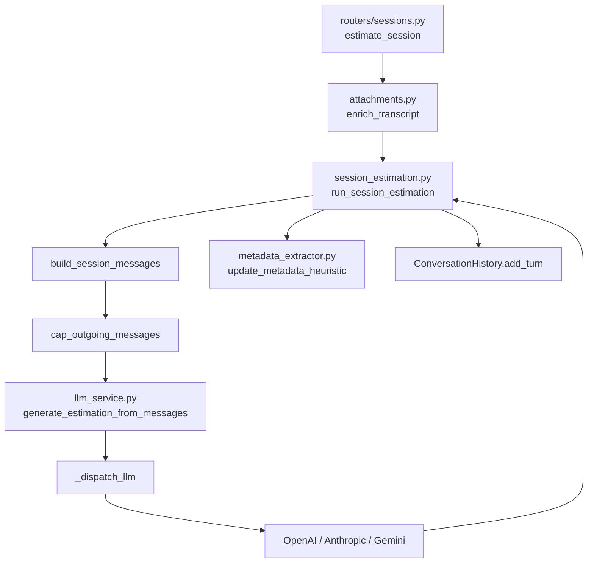

# Estimator architecture

Architecture notes for the FastAPI estimator service. For setup, env vars, and curl examples see [README.md](../README.md).

## Request paths

| Path | Entry | LLM entrypoint | Prompt source |
|------|-------|----------------|---------------|
| Form API | `POST /api/v1/estimate` | `generate_estimation_from_request` | `render_estimation_prompt` (v1/v2) |
| Session API | `POST /sessions/{id}/estimate` | `run_session_estimation` → `generate_estimation_from_messages` | `render_session_system_prompt` + `render_session_user_prompt` (v2 default) |

Both paths converge on `_dispatch_llm` in `app/services/llm_service.py`, which routes a message array (system first, then user/assistant turns) to OpenAI, Anthropic, or Gemini.

## Multi-turn session LLM message flow

Each `POST /sessions/{session_id}/estimate` call runs the pipeline below. Attachments are extracted locally (Path B) and concatenated into the transcript before orchestration begins.

### Step-by-step

1. **`build_session_estimation_request`** — Maps the enriched transcript to a fixed `EstimationRequest` (web SaaS, medium detail, phases table). Uses `model_construct` so large attachment text is not capped at 2000 characters.

2. **`build_session_messages`** — Assembles the outgoing payload:
   - Regenerates the **system prompt** from current `project_metadata` via `render_session_system_prompt` and `_project_metadata.j2`.
   - Prepends prior turns from `ConversationHistory.to_messages_list(system_prompt)`.
   - Appends the **current user message** from `render_session_user_prompt` (not stored in history until after the LLM responds).

3. **`cap_outgoing_messages`** — Trims the oldest user/assistant pairs so non-system content sent to the LLM respects `MAX_CONVERSATION_TURNS` (default `6`). The current user message counts toward the cap. Orphan leading assistant messages (not a full pair) are dropped one at a time.

4. **`generate_estimation_from_messages`** — Public LLM entrypoint for any multi-turn array. Logs `message_count` and `history_turns`, then calls `_dispatch_llm`.

5. **`_dispatch_llm`** — Splits system from turns (`_split_system_and_turns`) and dispatches:
   - **OpenAI** — full message array (system + turns).
   - **Anthropic** — `system` parameter plus `messages` turn list.
   - **Gemini** — `system_instruction` plus mapped turn contents.

6. **Post-turn memory** — `update_metadata_heuristic` refreshes `project_metadata`; `history.add_turn` stores the **rendered user prompt** (including attachment blocks) and the assistant estimation. `ConversationHistory._trim` enforces the same window limit in stored history.

### Sliding window: two layers

| Layer | Where | What it limits |
|-------|-------|----------------|
| Stored history | `ConversationHistory._trim` | User/assistant pairs kept in the in-memory session |
| Outgoing LLM payload | `cap_outgoing_messages` | Non-system messages sent on each API call |

Both use `MAX_CONVERSATION_TURNS * 2` message slots. Facts that must survive truncation live in `project_metadata`, which is re-injected into the system prompt every turn.

### Single-turn convenience

`generate_session_estimation` builds a two-message array (system + user) and delegates to `generate_estimation_from_messages`. Session orchestration uses the message-array API directly so prior turns are included.

## Provider abstraction

All provider wrappers return the same dict shape (`estimation`, `model`, `provider`, `finish_reason`, `usage`). `generate_estimation_from_messages` maps `estimation` → `text` for the session and form API contracts.

`thinking_budget` is honored only for Anthropic; OpenAI and Gemini log a warning and ignore it.

## Session state

Sessions live in a process-local `SessionStore` (no database). Each `Session` holds:

- `ConversationHistory` — user/assistant turns only; system prompt is never stored.
- `ProjectMetadata` — distilled facts updated heuristically after each turn.
- `session_id`, `created_at`, `updated_at`.

Restarting the process clears all sessions.
