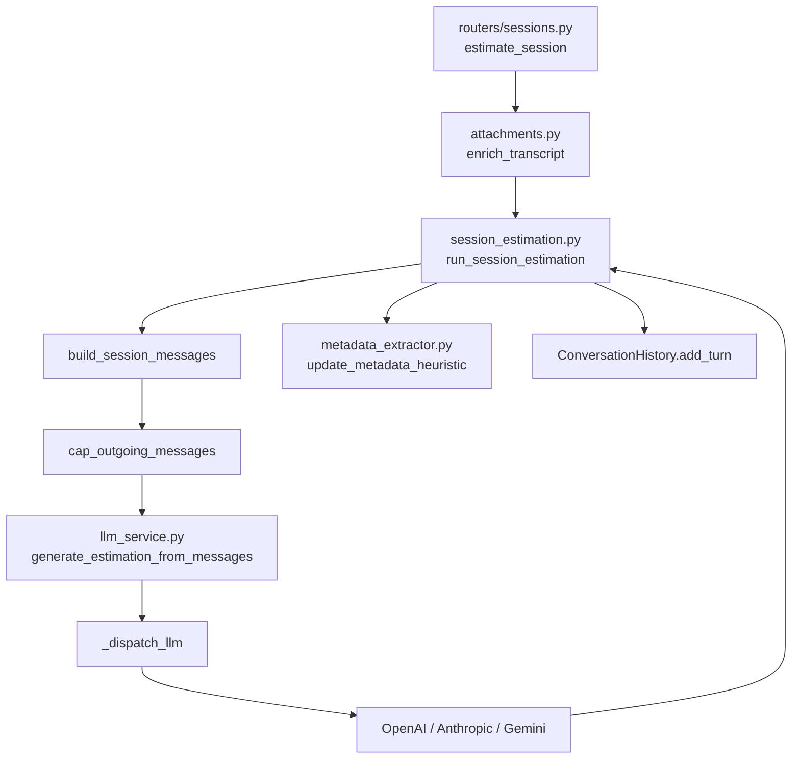
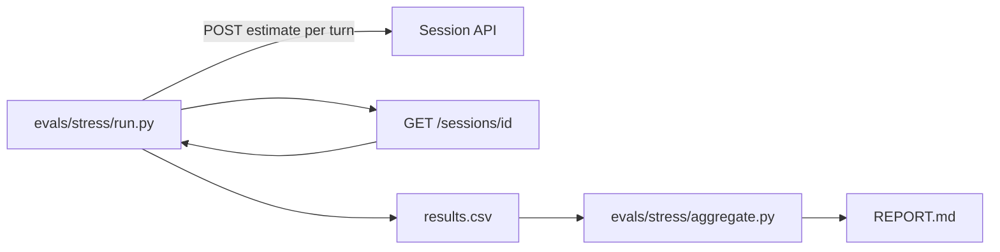
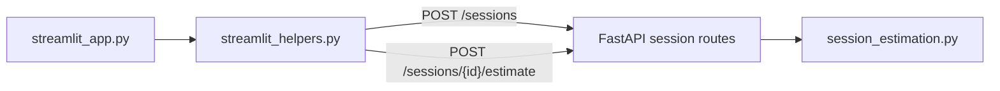

# Estimator architecture

Architecture notes for the FastAPI estimator service. For setup, env vars, and curl examples see [README.md](../README.md).

## Request paths

| Path | Entry | LLM entrypoint | Prompt source |
|------|-------|----------------|---------------|
| Form API | `POST /api/v1/estimate` | `generate_estimation_from_request` | `render_estimation_prompt` (v1/v2) |
| Session API | `POST /sessions/{id}/estimate` | `run_session_estimation` → `generate_estimation_from_messages` | `render_session_system_prompt` + `render_session_user_prompt` (v2 default) |
| Session snapshot | `GET /sessions/{id}` | — (read-only) | — |

Both paths converge on `_dispatch_llm` in `app/services/llm_service.py`, which routes a message array (system first, then user/assistant turns) to OpenAI, Anthropic, or Gemini.

## Multi-turn session LLM message flow

Each `POST /sessions/{session_id}/estimate` call runs the pipeline below. Attachments are extracted locally (Path B) and concatenated into the transcript before orchestration begins.

### Step-by-step

1. **`build_session_estimation_request`** — Maps the enriched transcript to a fixed `EstimationRequest` (web SaaS, medium detail, phases table). Uses `model_construct` so large attachment text is not capped at 2000 characters.

2. **`build_session_messages`** — Assembles the outgoing payload:
   - Regenerates the **system prompt** from current `project_metadata` via `render_session_system_prompt` and `_project_metadata.j2`.
   - Prepends prior turns from `ConversationHistory.to_messages_list(system_prompt)`.
   - Appends the **current user message** from `render_session_user_prompt` (not stored in history until after the LLM responds).

3. **`cap_outgoing_messages`** — Trims the oldest user/assistant pairs so non-system content sent to the LLM respects `MAX_CONVERSATION_TURNS` (default `6`). The current user message counts toward the cap. Orphan leading assistant messages (not a full pair) are dropped one at a time.

4. **`generate_estimation_from_messages`** — Public LLM entrypoint for any multi-turn array. Logs `message_count` and `history_turns`, then calls `_dispatch_llm`.

5. **`_dispatch_llm`** — Splits system from turns (`_split_system_and_turns`) and dispatches:
   - **OpenAI** — full message array (system + turns).
   - **Anthropic** — `system` parameter plus `messages` turn list.
   - **Gemini** — `system_instruction` plus mapped turn contents.

6. **Post-turn memory** — `update_metadata_heuristic` refreshes `project_metadata`; `history.add_turn` stores the **rendered user prompt** (including attachment blocks) and the assistant estimation. `ConversationHistory._trim` enforces the same window limit in stored history.

### Sliding window: two layers

| Layer | Where | What it limits |
|-------|-------|----------------|
| Stored history | `ConversationHistory._trim` | User/assistant pairs kept in the in-memory session |
| Outgoing LLM payload | `cap_outgoing_messages` | Non-system messages sent on each API call |

Both use `MAX_CONVERSATION_TURNS * 2` message slots. Facts that must survive truncation live in `project_metadata`, which is re-injected into the system prompt every turn.

### Single-turn convenience

`generate_session_estimation` builds a two-message array (system + user) and delegates to `generate_estimation_from_messages`. Session orchestration uses the message-array API directly so prior turns are included.

## Provider abstraction

All provider wrappers return the same dict shape (`estimation`, `model`, `provider`, `finish_reason`, `usage`). `generate_estimation_from_messages` maps `estimation` → `text` for the session and form API contracts.

`thinking_budget` is honored only for Anthropic; OpenAI and Gemini log a warning and ignore it.

## Session state

Sessions live in a process-local `SessionStore` (no database). Each `Session` holds:

- `ConversationHistory` — user/assistant turns only; system prompt is never stored.
- `ProjectMetadata` — distilled facts updated heuristically after each turn.
- `session_id`, `created_at`, `updated_at`.

Restarting the process clears all sessions.

## Session snapshot and observation

`GET /sessions/{session_id}` returns a `SessionSnapshotResponse` for stress-test observation and debugging. Fields:

| Field | Description |
|-------|-------------|
| `session_id` | Session identifier |
| `message_count` | Stored user/assistant turns in history |
| `anchors_count` / `anchors` | Promoted facts retained across window truncation |
| `summary_chars` / `summary` | Rolling cumulative summary (capped at 2000 chars) |
| `last_resolved_tier` / `last_tier_rule` | Dynamic prompt tier from enriched transcript size |
| `project_metadata` | Heuristic facts (name, stack, team, scope) |
| `last_turn_observed` | Per-turn bundle from the most recent estimate (see below) |

At the end of each `run_session_estimation` call, the service populates `session.last_turn_observed` with tokens, cost, latency, cache hit kind, window size, and attachment stats, then logs a `turn_observed` structlog event with the same payload. The stress runner (`evals/stress/run.py`) reads the snapshot after every estimate turn so metrics use genuine server state rather than inferring from the response body alone.

## CAG memory stack (session path)

Beyond the sliding-window history and heuristic `project_metadata`, the session path maintains additional context injected into the system prompt each turn:

| Component | Module | Role |
|-----------|--------|------|
| Anchors | `anchor_extractor.py` | Promotes durable facts from turns so they survive history truncation |
| Summary | `summarizer.py` | Rolling cumulative summary, capped at 2000 characters |
| Tiers | `tiers.py` | Selects prompt detail level (`low` / `medium` / `high`) from enriched transcript size vs `TIER_MEDIUM_CHARS` / `TIER_HIGH_CHARS` |
| Metadata | `metadata_extractor.py` | Heuristic `project_metadata` update after each turn (see README) |

Facts that must survive window truncation live in anchors, summary, and `project_metadata`, all re-injected via Jinja partials (`_anchors.j2`, `_summary.j2`, `_project_metadata.j2`) on every LLM call.

## LLM instrumentation

**Cost tracking** — `llm_wrapper.compute_cost_usd` uses the `MODEL_COSTS` table keyed by model id (prefix-matched for versioned ids). Each provider wrapper records `tokens_in`, `tokens_out`, `latency_ms`, and `cost_usd` in the returned usage dict.

**Response cache** — `llm_cache.py` provides exact and semantic cache lookup before dispatching to the provider. Controlled by `LLM_CACHE_ENABLED` (default `true`) and `SEMANTIC_CACHE_THRESHOLD` (default `0.85`). Cache hit kind (`none` / `exact` / `semantic`) is included in `last_turn_observed`.

## Stress evaluation pipeline

Exercise 6.1 adds `evals/stress/` — a CLI harness that drives the session API through synthetic multi-turn scenarios with optional PDF attachments.

- **Transport** — in-process (`TestClient`, default) or `--http` against a running API.
- **Scenarios** — `evals/stress/scenarios.py` defines `growing`, `pivot`, and `contradiction` profiles with fact-trackers for memory-drift measurement.
- **Metrics** — `evals/stress/metrics.py` consumes snapshot data and scenario trackers (`MemoryDriftMetric`, latency/cost budgets, attachment recall).
- **Aggregation** — `evals/stress/aggregate.py` reads `results.csv` and writes `REPORT.md` (English) plus optional localized Spanish report.

Mocked runs patch `generate_estimation_from_messages` for fast CI; `--real-llm --cache-on` exercises the full stack including cache hit rates.

## Clients

### Streamlit (`streamlit_app.py`)

The Session 5 UI is an **HTTP client only** — it does not import `llm_service` or call providers directly. FastAPI must be running separately (default `http://localhost:8000`).

| UI action | HTTP call | Local state updated |
|-----------|-----------|---------------------|
| Page load / bootstrap | `POST /sessions` via `ensure_session_id` | `session_id` |
| **Estimate** | `POST /sessions/{id}/estimate` (multipart: transcript + optional PDF/DOCX) | `last_estimation`, `project_metadata` |
| **New conversation** | `POST /sessions` via `reset_conversation_state` | New `session_id`; clears `project_metadata` and `last_estimation` |

Pure HTTP and validation logic lives in `app/ui/streamlit_helpers.py` (no Streamlit imports) so behaviour is unit-testable without AppTest. The sidebar displays `project_metadata` returned by the API — memory the server maintains across turns, distinct from the transcript the user types each time.

The legacy Session 4 form client (`POST /api/v1/estimate`) is no longer exposed in Streamlit; the form API path remains available for curl, tests, and other HTTP clients.
